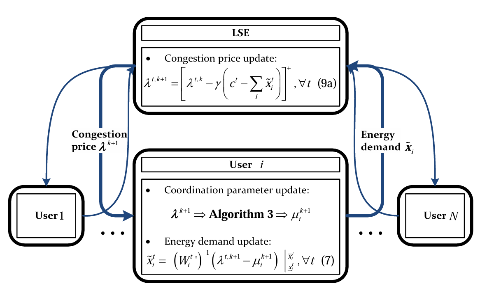
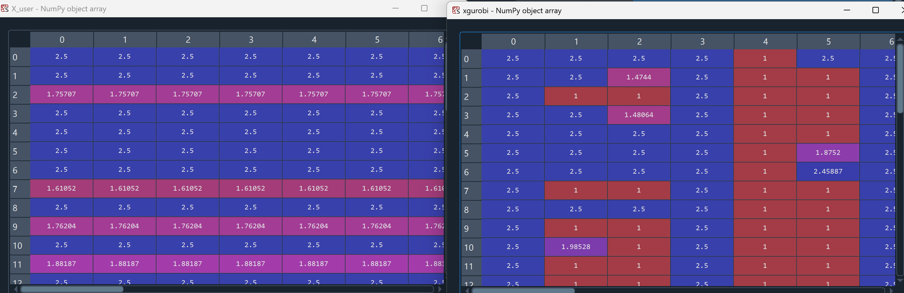

# 毕设

## 首先是关于distributed optimization的问题

主要参考文献：___Fast Distributed Demand Response With Spatially-
and Temporally-Coupled Constraints in Smart Grid___

文章主要考虑这样一个问题：

> $$\begin{aligned}
\max_\textbf{X} \ \textbf{W}(\textbf{X})\\
s.t. \  \sum_t x_i^t\ge r_i \ \ \ \forall i\\
\sum_ix_i^t \le c^t \ \ \ \forall t\\
\underline{x}_i^t\le x_i^t \le \overline{x}_i^t \ \ \ \forall i,t  
\end{aligned}
$$

这里
$$\textbf{W}(\textbf{X})=\sum_{i,t}W_i^t(x_i^t)$$
$$W_i^t(x_i^t)=U_i^t(x_i^t)-p^tx_i^t$$

文章中定义：

$$U_i^t(x_i^t)=\begin{cases}
-(x_i^t-y)^2,&0\le x_i^t\le y\\
0,&x_i^t>y 
\end{cases}$$

算法分别在LSE端和用户端进行。用户向LSE提供 $\tilde{x}_i $，使LSE更新 $\lambda $,LSE向用户提供 $\lambda^{k+1}$,使用户更新 $\mu$和 $x_i^t$



LSE侧：

```python
def update_lambda(self):
        total_demand = np.zeros(self.num_timeslots)
        for t in range(self.num_timeslots):
            total_demand[t] = sum(user.x[t] for user in self.users)
        delta = total_demand - self.capacity
        self.lambda_t0 = self.lambda_t
        self.lambda_t = np.maximum(self.lambda_t + self.step_size * delta, 0)

```

用户侧：

```python
    def fast_solve_mu(self, lambda_t, epsilon):
        # Step 1: 初始条件检查
        initial_demand_sum = self.demand_sum(0, lambda_t)
        if initial_demand_sum > self.r_i:
            self.mu = 0
            return
    
        # Step 2: 二分搜索
        breakpts = self.get_pos_breakpts(lambda_t)
        left, right = 0, len(breakpts) - 1
        
        while right - left > 1:
            middle = (left + right) // 2
            M = self.demand_sum(breakpts[middle], lambda_t)
            
            if M == self.r_i:
                self.mu = breakpts[middle]
                return breakpts[middle]
            elif M < self.r_i:
                left = middle
            else:
                right = middle
    
        # Step 3: 划分时间段集合 T1, T2, T3
        T1 = [t for t in range(len(lambda_t)) if lambda_t[t] + self.price[t] <= breakpts[left]]
        T2 = [t for t in range(len(lambda_t)) if lambda_t[t] - (-2 * (self.demand_bounds[0] - self.y) - self.price[t]) >= breakpts[right]]
        T3 = [t for t in range(len(lambda_t)) if t not in T1 and t not in T2]
    
        # Step 4: 计算满足总需求的 mu 值
        demand_sum_T1 = self.demand_bounds[1] * len(T1)
        demand_sum_T2 = self.demand_bounds[0] * len(T2)
        
        self.mu0 = self.mu
        self.mu = (sum((lambda_t[t] + self.price[t]) for t in T3) + 
                   2 * (self.r_i - demand_sum_T1 - demand_sum_T2)) / len(T3) - 2 * self.y
```

```python
# 更新用户的需求 x_i^t
    def update_demand(self, lambda_t):
        x_min, x_max = self.demand_bounds
        xit = np.zeros(self.T)# 用来存储 (W^{t'}_i)^{-1} 的计算结果
        for t in range(self.T):
            # 计算 μ_i^t 和 μ̄_i^t
            mu_t_lower = lambda_t[t] - (-2 * (x_min - self.y) - self.price[t])
            mu_t_upper = lambda_t[t] + self.price[t]
            
            # 根据条件选择 x_i^t
            if self.mu <= mu_t_lower:
                xit[t] = x_min
            elif self.mu >= mu_t_upper:
                xit[t] = x_max
            else:
                # 计算 (W^{t'}_i)^{-1}(\lambda_t - μ_i)
                xit[t] = self.W_derivative_inv(lambda_t)[t]
        
        # 更新需求 x 为 Wprime_inv 的结果，确保需求在上下限内
        self.x = np.clip(xit, x_min, x_max)
        #return self.x
```

但这里有一些问题，$W(x)$并不是一个可逆的函数，在处理的时候认为了$x$都处于可逆的部分，但这样似乎存在一些问题。

试图用gurobi来验证结果，将分段函数建模成混合整数的形式，引入01变量，但是并不是一个线性问题，最后结果和编写的算法存在一些差别。认为这个问题在于$W(x)$的具体形式，这个问题是个比较复杂的非凸优化问题，后续需要根据要处理优化目标修改程序。

